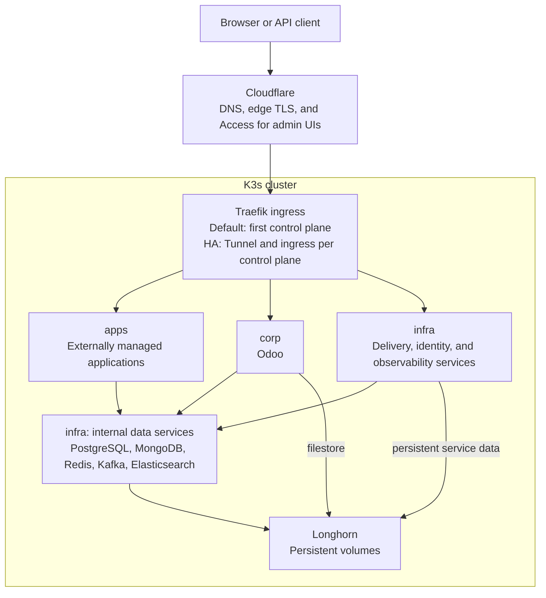

# Bare-Metal Cluster

K3s infrastructure for a single server or a cluster of control planes and workers.
This repository installs and manages the shared platform: networking, storage,
identity, databases, delivery, observability, security, and Odoo.

The installer prompts for your organization, domain, node, and delivery identity
before installation. Configuration is parameterized for each deployment; see
[organization settings](docs/installation.md#organization-and-installation-identity)
for interactive setup, unattended inputs, and preservation of existing settings.

Application repositories own their runtime manifests, pipelines, secrets
contracts and Argo CD Applications. The platform discovers supported workloads
through Kubernetes metadata; it has no application repository inventory.
Use [`add-repos.sh`](docs/repository-onboarding.md) to import repositories and
configure selected applications from their own onboarding declarations.

Deploy application workloads in the **`apps` Kubernetes namespace** to enable
automatic discovery by **SonarQube, Prometheus/Grafana, and ELK/Kibana**. The
platform creates per-application metrics and logs dashboards and discovers source
projects for Sonar analysis. See the [namespace and discovery requirements](docs/application-onboarding.md#namespace-and-automatic-discovery)
for deployment settings, the Sonar scanner contract, and optional metrics endpoints.

## Topology

The default public entry point is the first control plane. Nodes communicate
over a private network, with one control plane or an odd embedded-etcd quorum
plus optional workers. The opt-in [HA profile](docs/high-availability.md) adds
replicated Tunnel ingress and shared-service quorums after explicit data
migrations. HA requires additional physical hosts; adding nodes alone does not
enable it. Each application repository configures and verifies its own
availability. Persistent singleton tools still have
an outage while their writer and volume recover safely.

| Namespace | Responsibility |
|---|---|
| `infra` | Shared platform services, managed here |
| `apps` | External applications, managed by their repositories |
| `corp` | Corporate applications; Odoo is managed here |
| `gitlab-runners` | Isolated CI job workloads |
| `longhorn-system` | Persistent storage management |
| `kube-system` | Kubernetes networking and system components |

Vault supplies credentials through External Secrets. Argo CD reconciles desired
state from GitLab. PostgreSQL, MongoDB, Redis, Kafka, Elasticsearch, and
Prometheus remain internal services. [Networking](docs/networking.md) explains
private transport, service DNS, and public exposure.

See the [node topology](docs/networking.md#node-topology) and
[application and platform CI/CD flows](docs/delivery.md#pipelines-and-outputs)
for the deployment view.

## Services and URLs

[Homepage](https://intranet.swirlit.dev) is the live service directory, including
internal components and application-owned entries. The links below use
`swirlit.dev`; installation renders the domain you select. Administrative UIs
use the access controls described in [security and identity](docs/security.md).

| Service | URL | Purpose |
|---|---|---|
| Odoo | [odoo.swirlit.dev](https://odoo.swirlit.dev) | ERP and CRM |
| Homepage | [intranet.swirlit.dev](https://intranet.swirlit.dev) | Service catalog and cluster status |
| GitLab | [gitlab.swirlit.dev](https://gitlab.swirlit.dev) | Source, CI, artifacts, and packages |
| Container Registry | [registry.swirlit.dev](https://registry.swirlit.dev/v2/) | OCI image API; browse images in GitLab |
| Argo CD | [argocd.swirlit.dev](https://argocd.swirlit.dev) | GitOps delivery |
| SonarQube | [sonarqube.swirlit.dev](https://sonarqube.swirlit.dev) | Source quality analysis |
| Grafana | [grafana.swirlit.dev](https://grafana.swirlit.dev) | Metrics and security dashboards |
| Kibana | [kibana.swirlit.dev](https://kibana.swirlit.dev) | Logs and audit dashboards |
| Keycloak | [keycloak.swirlit.dev](https://keycloak.swirlit.dev/auth/admin/master/console/) | Identity administration |
| Vault | [vault.swirlit.dev](https://vault.swirlit.dev) | Secrets and policies |
| Longhorn | [longhorn.swirlit.dev](https://longhorn.swirlit.dev) | Volumes, snapshots, and backups |
| Portainer | [portainer.swirlit.dev](https://portainer.swirlit.dev) | Kubernetes management |
| DBGate | [dbgate.swirlit.dev](https://dbgate.swirlit.dev) | PostgreSQL, MongoDB, and Redis administration |
| Kafbat UI | [kafka.swirlit.dev](https://kafka.swirlit.dev) | Kafka administration |
| Trivy reports | [Grafana dashboard](https://grafana.swirlit.dev/d/trivy-security/trivy-security-reports) | Current workload and cluster findings |
| Lynis reports | [Kibana dashboard](https://kibana.swirlit.dev/app/dashboards#/view/lynis-security-audits) | Host audit history |

Supporting components include K3s/CoreDNS/ServiceLB, Traefik Ingress, Longhorn,
External Secrets, the Descheduler, Prometheus/Alertmanager, node exporter,
kube-state-metrics, Elasticsearch/Logstash/Fluent Bit/Filebeat, and Trivy
Operator. Host controls use UFW, Fail2ban, CrowdSec, and Lynis according to node
role and exposure.

## Repository layout

The root commands install the cluster, add nodes and onboard repositories.
`config/` owns defaults and host inputs; `k8s/` owns desired platform resources;
`scripts/` owns automation; `ansible/` provides unattended entry points.
`tests/` contains only deployment and recovery safety checks.

See the [directory map and maintenance rules](docs/structure.md) for every
directory's purpose, where to make changes and why the remaining tests exist.

## Documentation

| Task | Guide |
|---|---|
| Install the cluster | [Installation](docs/installation.md) |
| Choose private transport and exposure | [Networking](docs/networking.md) |
| Add control planes or workers | [Node enrollment](docs/node-enrollment.md) |
| Prepare and activate availability across hosts | [High availability](docs/high-availability.md) |
| Install or reconcile through Ansible | [Ansible](docs/ansible.md) |
| Understand CI, registries, and GitOps | [Delivery](docs/delivery.md) |
| Add, synchronize and deploy repositories | [Repository onboarding](docs/repository-onboarding.md) |
| Author an app's setup declaration | [Onboarding contract](docs/application-onboarding.md) |
| Configure automatic and manual source analysis | [Sonar discovery](docs/sonar-discovery.md) |
| Discover per-application Grafana and Kibana dashboards | [Application observability](docs/application-observability.md) |
| Monitor, maintain storage, back up, or validate changes | [Operations](docs/operations.md) |
| Manage host policy, SSO, and credentials | [Security and identity](docs/security.md) |
| Migrate an existing controller and private images | [Platform migration](docs/platform-migration.md) |
| Maintain platform image versions and recovery | [Container images](docs/security-images.md) |
| Operate and recover Vault | [Vault](docs/vault.md) |
| Maintain UI themes | [Platform themes](docs/platform-themes.md) |

Guides describe maintained behavior and link to its owning source. Git history
retains past fixes and migrations.

## License

[GNU General Public License v3.0](LICENSE).
