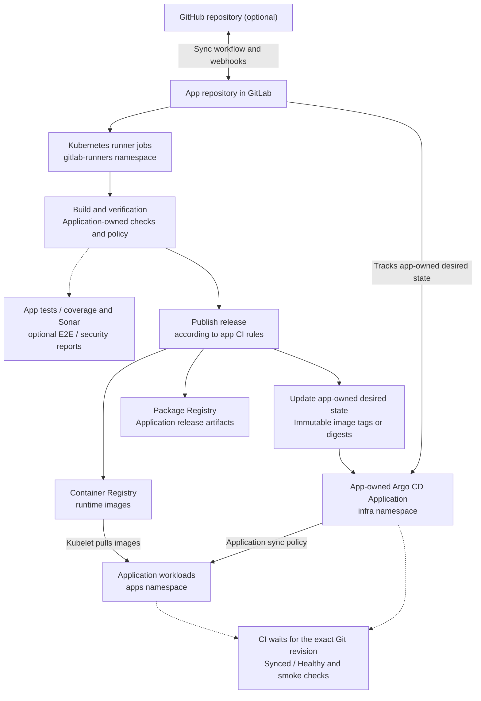
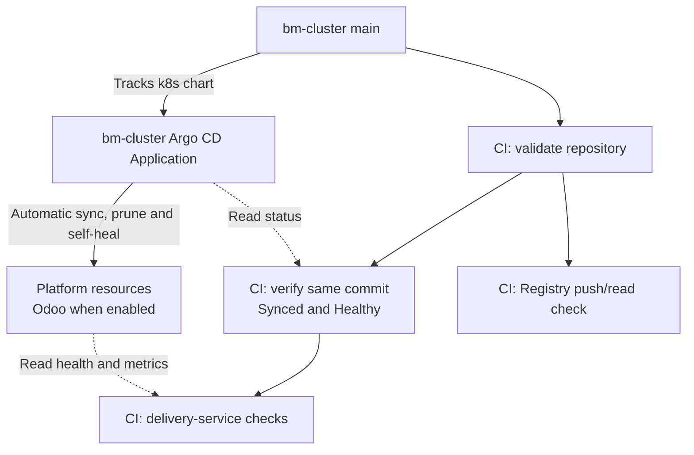

# Delivery and GitOps

`bm-cluster` supplies GitLab, the instance runner, registries, Argo CD and SonarQube.
Application repositories own their CI jobs, credentials contracts, runtime
manifests and Argo CD Applications.

## Ownership and bootstrap

The platform project is `<gitlab-group>/bm-cluster`. Its
[pipeline](../.gitlab-ci.yml) runs on the shared Kubernetes runner in
`gitlab-runners`. The [root Application](../k8s/addons/bm-cluster-application.yaml)
reconciles the platform from Git, including centrally owned Odoo in `corp` when
`appsEnabled=true`. External applications run in `apps` and reconcile through
their own Applications. The platform does not declare their repository names,
resource paths, release policies or deployment profiles.

Each application's deployment guide owns its database, Vault, registry and CI
inputs, bootstrap procedure and recovery steps. Changes to its runtime resources
and Argo CD Application belong in that repository. Public records follow the
[application DNS contract](networking.md#application-dns-ownership).
The shared `apps` foundation remains installed when Odoo/`corp` is disabled.

The installer and [Ansible](ansible.md) run
[`configure-gitlab-ci.sh`](../scripts/configure-gitlab-ci.sh) to reconcile the
platform group/project, Dependency Proxy, cleanup policies, instance runner and
Vault-backed tokens. On the control plane, setup creates a short-lived GitLab
administrator token through `gitlab-rails` and revokes it on exit; no manually
created token is required. Credentials are not committed.

To import GitHub repositories, configure two-way synchronization and select
deployments, run `./add-repos.sh`. The installer and Ansible invoke the same
helper after platform setup. It consumes the app-owned
[`infra/onboarding.json` contract](application-onboarding.md), commits public
settings, provisions declared prerequisites/DNS and requests an API pipeline
pinned to that configuration. The app's release job owns first Application
creation and restores any paused sync policy. Success requires declared jobs
and app readiness, rather than merely pipeline creation. See
[repository onboarding](repository-replication.md) for inputs and recovery.

## Pipelines and outputs

### Application delivery

This diagram describes the integration boundary. Each application's CI defines
its required tests, report failure policy, release approval rules, artifacts and
rollout verification. Publishing an image does not update a deployment by itself:
the application must update its desired state and reconcile its own Application.
Keep image selection and any bootstrap path changes in the application's Git
history so later releases preserve them.

The [source-analysis contract](sonar-discovery.md) supports automatic discovery
and manual scan-only pipelines. An application implementing that contract must
exclude publication and deployment from scan-only runs.

### Infrastructure reconciliation and verification

The [infrastructure pipeline](../.gitlab-ci.yml) runs on the shared Kubernetes
runner. Default-branch verification observes reconciliation; Argo CD starts its
sync independently of CI validation. Installer/Ansible still own the Argo CD Helm
release itself, as described in [Argo CD operations](#argo-cd-operations).

## Registry and dependencies

Private OCI images use `registry.<public-domain>`. CI uses the internal GitLab
API/clone and Registry service routes, while user-facing links retain the public
hostnames. K3s/containerd maps the public Registry hostname to its internal service.
The Dependency Proxy uses the canonical `gitlab.<public-domain>` HTTPS route:
containerd mirror query parameters interfere with Workhorse cache uploads.
Machine requests must be able to use these routes without browser-only Access
authentication or bot challenges.

The infrastructure pipeline pins its public Alpine image by digest; the runner's
`IfNotPresent` policy reuses the node-local image. The group Dependency Proxy is
available for upstream image acceleration. Maven/npm dependencies come from
their public upstreams and use the persistent
[runner cache](../k8s/platform/gitlab-runner.yaml). App image jobs can rebuild
their disposable Kaniko layers. A cold pipeline must still build, test and
release successfully; caches are an optimization.

## Storage and retention

GitLab repositories, Registry data, packages and artifacts share the `gitlab-data`
PVC in [the GitLab manifest](../k8s/platform/gitlab.yaml). Installer, Ansible and
GitOps consume that declaration. Capacity expansion does not reclaim old data;
see [operations](operations.md) for storage maintenance and backups.

The daily [retention job](../k8s/platform/gitlab-registry-retention.yaml) reconciles
GitLab's native container-tag cleanup policy for projects in the configured group
and its subgroups, and deletes Package Registry versions older than the declared
retention period. GitLab retains protected tags and the literal `latest` tag.
The group API token comes from Vault `secret/infra/gitlab` through External Secrets.
Removing tags or packages and reclaiming physical Registry storage are separate
operations. Keep recovery images available before removing old image data; the
[security image guide](security-images.md) covers the bootstrap/private-registry
dependency.

GitLab and runner metrics feed the provisioned GitLab Delivery Grafana dashboard;
their container logs feed Elasticsearch/Kibana. See
[observability](operations.md#observability) and [validation](operations.md#validation).

## Argo CD operations

The installer and `ansible/deploy.yml` install Argo CD through Helm using rendered
[`config/argocd-values.yaml`](../config/argocd-values.yaml) and version pins from
[`config/platform.env`](../config/platform.env). The root Application manages
platform resources after bootstrap; it does not upgrade its own Argo CD Helm
release. Reconcile Helm changes through the installer, Ansible, or a Helm upgrade
with those same rendered inputs and pins.

With `HIGH_AVAILABILITY_ENABLED=true`, the installer and Ansible also apply
[`config/argocd-ha-values.yaml`](../config/argocd-ha-values.yaml). API/repository
servers and ApplicationSet controllers run in pairs on separate hosts. The
disposable Redis cache uses three Sentinel peers with authenticated Redis and
Sentinel connections, two HAProxy endpoints, and disruption budgets.

The application controller remains one active process. The overlay enables
upstream [dynamic cluster distribution](https://argo-cd.readthedocs.io/en/stable/operator-manual/dynamic-cluster-distribution/)
to run it as a Deployment, with 30-second not-ready/unreachable tolerations so
Kubernetes can replace it on a surviving host. With one replica it processes
the whole cluster; there is no second controller acting as a standby. GitOps
reconciliation pauses while the replacement starts and rebuilds its cache.
Upstream marks this mechanism alpha, so check its chart behavior during upgrades.
Existing applications continue running during that pause.

The application controller caches cluster resources. Its `GOMEMLIMIT` is kept
below the container memory limit to leave room for non-Go allocations and
transient work. This is a soft Go runtime limit, not a hard process bound. Keep
the values together in `config/argocd-values.yaml`; see the upstream
[Argo CD memory guidance](https://argo-cd.readthedocs.io/en/stable/operator-manual/high_availability/#mitigating-oomkilled-events-from-memory-spikes).

After a Helm change, wait for the controller rollout and check that Applications
return to `Synced` and `Healthy`. Confirm `go_gc_gomemlimit_bytes` matches the
configured value and observe restarts, working memory, garbage collection, CPU
and reconciliation duration across startup and normal cycles. If memory pressure
persists, inspect the live heap/cache and adjust both budgets within node capacity.
