# Delivery and GitOps

The platform supplies GitLab, an instance runner, registries and Argo CD.
Application repositories own their CI, runtime manifests and Applications.
Use [repository onboarding](repository-onboarding.md) to import or deploy an app;
this guide explains the shared delivery path and how to maintain it.

## Ownership and bootstrap

The [root Application](../k8s/addons/bm-cluster-application.yaml) reconciles the
platform chart, including Odoo when enabled. Each external application has its
own Application and deployment guide. Application runtime changes belong in that
repository; the platform has no application repository inventory.

The installer and [Ansible](installation.md) run
[configure-gitlab-ci.sh](../scripts/configure-gitlab-ci.sh) to reconcile the
configured group/project, Dependency Proxy, retention policies, instance runner
and Vault-backed tokens. Setup creates a temporary GitLab administrator token
through `gitlab-rails` on the control plane and revokes it on exit. No manually
created token is required.

## Pipelines and outputs

### Application delivery

```mermaid
flowchart LR
    accTitle: Application delivery
    accDescr: Application CI checks source, publishes an image and commits its selection. Argo CD deploys it and CI verifies that exact revision.
    Source["App source in GitLab"] --> CI["App-owned checks<br/>Shared Kubernetes runner"]
    CI --> Publish["Publish image / packages"]
    Publish --> Commit["Commit image selection<br/>to app desired state"]
    Commit --> Argo["App Argo CD Application"]
    Argo --> Runtime["Workloads in apps"]
    Runtime --> Verify["CI verifies exact revision<br/>health and smoke checks"]
```

GitHub/GitLab synchronization is configured by [repository onboarding](repository-onboarding.md).
Each app defines its release policy, artifacts and checks. Publishing an image
alone does not deploy it: commit image selection and bootstrap path changes in
its desired state, then verify that revision through Argo CD. See the
[source-analysis contract](observability.md#source-analysis) for scan-only CI.

### Infrastructure reconciliation and verification

The [platform pipeline](../.gitlab-ci.yml) and Argo CD act independently:

| Path | Responsibility |
| --- | --- |
| Argo CD | Reconcile `main` into platform resources with automatic sync, prune and self-heal. |
| CI | Run [repository validation](operations.md#validation); on the default branch, verify the same commit is Synced/Healthy and check delivery services and Registry push/read. |

CI observes reconciliation; it does not gate the start of Argo's sync.
The separately installed Argo CD Helm release follows the upgrade procedure below.

## Registry and dependencies

Use the [service DNS and registry routing contract](networking.md#service-dns-and-registry-routing)
for public names, internal CI/containerd routes and the Dependency Proxy. These
machine endpoints must remain usable without browser-only authentication or challenges.

The infrastructure pipeline pins its public Alpine image by digest; the runner's
`IfNotPresent` policy reuses the node-local image. The group Dependency Proxy can
accelerate upstream pulls. Maven/npm use their public upstreams and the persistent
[runner cache](../k8s/platform/gitlab-runner.yaml); app builds may use disposable
Kaniko layers. A cold pipeline must still build, test and release successfully.

[Operations](operations.md#gitlab-storage) owns Registry/package retention and
storage cleanup. [Observability](observability.md) covers delivery metrics and logs.

## Argo CD operations

The installer and `ansible/deploy.yml` install Argo CD through Helm using rendered
[`config/argocd-values.yaml`](../config/argocd-values.yaml) and version pins from
[`config/platform.env`](../config/platform.env). The root Application manages
platform resources after bootstrap; it does not upgrade its own Argo CD Helm
release. Reconcile Helm changes through the installer, Ansible, or a Helm upgrade
with those same rendered inputs and pins.

With `HIGH_AVAILABILITY_ENABLED=true`, the installer and Ansible also apply
[`config/argocd-ha-values.yaml`](../config/argocd-ha-values.yaml). API/repository
servers and ApplicationSet controllers run in pairs on separate hosts. The
disposable Redis cache uses three Sentinel peers with authenticated Redis and
Sentinel connections, two HAProxy endpoints, and disruption budgets.

The application controller remains one active process. The overlay enables
upstream [dynamic cluster distribution](https://argo-cd.readthedocs.io/en/stable/operator-manual/dynamic-cluster-distribution/)
to run it as a Deployment, with 30-second not-ready/unreachable tolerations so
Kubernetes can replace it on a surviving host. With one replica it processes
the whole cluster; there is no second controller acting as a standby. GitOps
reconciliation pauses while the replacement starts and rebuilds its cache.
Upstream marks this mechanism alpha, so check its chart behavior during upgrades.
Existing applications continue running during that pause.

The application controller caches cluster resources. Its `GOMEMLIMIT` is kept
below the container memory limit to leave room for non-Go allocations and
transient work. This is a soft Go runtime limit, not a hard process bound. Keep
the values together in `config/argocd-values.yaml`; see the upstream
[Argo CD memory guidance](https://argo-cd.readthedocs.io/en/stable/operator-manual/high_availability/#mitigating-oomkilled-events-from-memory-spikes).

After a Helm change, wait for the controller rollout and check that Applications
return to `Synced` and `Healthy`. Confirm `go_gc_gomemlimit_bytes` matches the
configured value and observe restarts, working memory, garbage collection, CPU
and reconciliation duration across startup and normal cycles. If memory pressure
persists, inspect the live heap/cache and adjust both budgets within node capacity.
