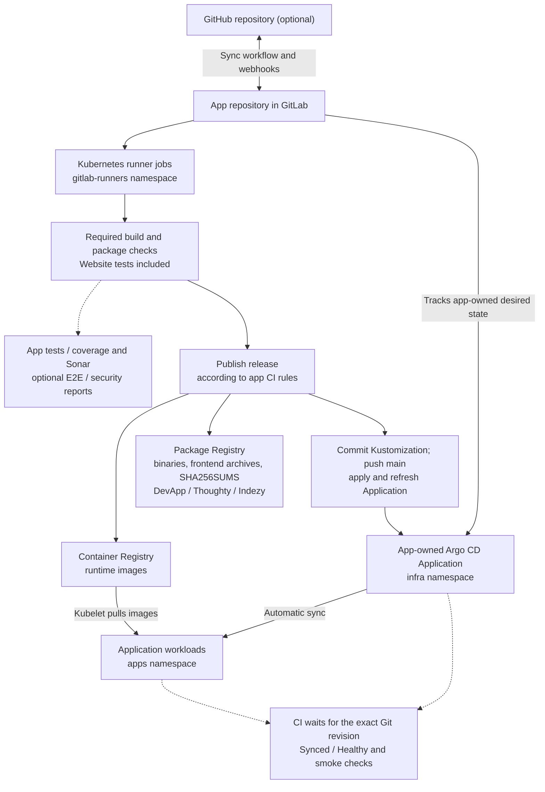
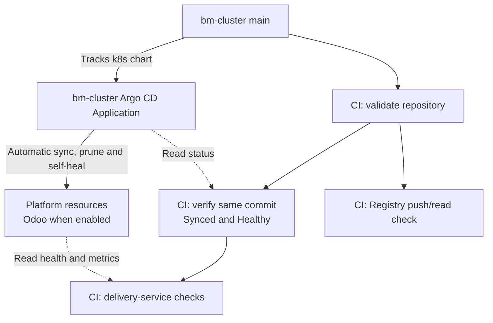

# Delivery and GitOps

`bm-cluster` supplies GitLab, the instance runner, registries, Argo CD and SonarQube.
Application repositories own their CI jobs, credentials contracts, runtime
manifests and Argo CD Applications.

## Ownership and bootstrap

The platform project is `<gitlab-group>/bm-cluster`. Its
[pipeline](../.gitlab-ci.yml) runs on the shared Kubernetes runner in
`gitlab-runners`. The [root Application](../k8s/addons/bm-cluster-application.yaml)
reconciles the platform from Git, including centrally owned Odoo in `corp` when
`appsEnabled=true`. First-party applications run in `apps` and reconcile through
their own Applications:

| Repository | Application bootstrap | Desired state |
| --- | --- | --- |
| `devapp` | `infra/argocd/application.yaml` | `infra/k8s` |
| `thoughty` | `infra/argocd/application.yaml` | `infra/k8s/overlays/bm-cluster` |
| `indezy` | `infra/argocd/application.yaml` | `infra/k8s` |
| `website` | `infra/argocd/application.yaml` | `infra/k8s` |

Each app's deployment guide covers its database, Vault, registry and CI inputs.
DevApp, Thoughty and Indezy also provide `infra/ansible/site.yaml` for operator
reconciliation. Keep application-specific resources in those repositories.

The installer and [Ansible](ansible.md) run
[`configure-gitlab-ci.sh`](../scripts/configure-gitlab-ci.sh) to reconcile the
platform group/project, Dependency Proxy, cleanup policies, instance runner and
Vault-backed tokens. On the control plane, setup creates a short-lived GitLab
administrator token through `gitlab-rails` and revokes it on exit; no manually
created token is required. Credentials are not committed.

To import GitHub repositories, configure two-way synchronization and select
deployments, run `./replicate-repo.sh`. The installer can invoke the same
assistant after platform setup. See [repository replication](repository-replication.md)
for permissions, deployment checks and unattended inputs.

## Pipelines and outputs

### Application delivery

DevApp, Thoughty and Indezy keep tests/coverage, Sonar and security reports
non-blocking. E2E is manual; security is manual in standard mode and automatic in
full mode. Their release is manual except for a web-launched full-mode pipeline.
Website requires its verification job, including tests and security checks,
before automatic default-branch image publication and release; Sonar is non-blocking.

The app-owned `infra/scripts/ci-release.sh` and image-selection helper commit
version tags for DevApp/Thoughty/Indezy, and an image digest for Website. Argo CD
reads those Git changes; CI reapplies the app's Application and verifies rollout.
Exact jobs, downloadable artifacts and failure policies belong in each app's
`.gitlab-ci.yml`. Default-branch Sonar runs automatically; manual and
discovery-triggered [scan-only pipelines](sonar-discovery.md) stop after the
build, tests/coverage and analysis, with no publication or deployment.

### Infrastructure reconciliation and verification

The [infrastructure pipeline](../.gitlab-ci.yml) runs on the shared Kubernetes
runner. Default-branch verification observes reconciliation; Argo CD starts its
sync independently of CI validation. Installer/Ansible still own the Argo CD Helm
release itself, as described in [Argo CD operations](#argo-cd-operations).

## Registry and dependencies

Private OCI images use `registry.<public-domain>`. CI uses the internal GitLab
API/clone and Registry service routes, while user-facing links retain the public
hostnames. K3s/containerd maps the public Registry hostname to its internal service.
The Dependency Proxy uses the canonical `gitlab.<public-domain>` HTTPS route:
containerd mirror query parameters interfere with Workhorse cache uploads.
Machine requests must be able to use these routes without browser-only Access
authentication or bot challenges.

The infrastructure pipeline pins its public Alpine image by digest; the runner's
`IfNotPresent` policy reuses the node-local image. The group Dependency Proxy is
available for upstream image acceleration. Maven/npm dependencies come from
their public upstreams and use the persistent
[runner cache](../k8s/platform/gitlab-runner.yaml). App image jobs can rebuild
their disposable Kaniko layers. A cold pipeline must still build, test and
release successfully; caches are an optimization.

## Storage and retention

GitLab repositories, Registry data, packages and artifacts share the `gitlab-data`
PVC in [the GitLab manifest](../k8s/platform/gitlab.yaml). Installer, Ansible and
GitOps consume that declaration. Capacity expansion does not reclaim old data;
see [operations](operations.md) for storage maintenance and backups.

The daily [retention job](../k8s/platform/gitlab-registry-retention.yaml) reconciles
GitLab's native container-tag cleanup policy for projects in the configured group
and its subgroups, and deletes Package Registry versions older than the declared
retention period. GitLab retains protected tags and the literal `latest` tag.
The group API token comes from Vault `secret/infra/gitlab` through External Secrets.
Removing tags or packages and reclaiming physical Registry storage are separate
operations. Keep recovery images available before removing old image data; the
[security image guide](security-images.md) covers the bootstrap/private-registry
dependency.

GitLab and runner metrics feed the provisioned GitLab Delivery Grafana dashboard;
their container logs feed Elasticsearch/Kibana. See
[observability](operations.md#observability) and [validation](operations.md#validation).

## Argo CD operations

The installer and `ansible/deploy.yml` install Argo CD through Helm using rendered
[`config/argocd-values.yaml`](../config/argocd-values.yaml) and version pins from
[`config/platform.env`](../config/platform.env). The root Application manages
platform resources after bootstrap; it does not upgrade its own Argo CD Helm
release. Reconcile Helm changes through the installer, Ansible, or a Helm upgrade
with those same rendered inputs and pins.

The application controller caches cluster resources. Its `GOMEMLIMIT` is kept
below the container memory limit to leave room for non-Go allocations and
transient work. This is a soft Go runtime limit, not a hard process bound. Keep
the values together in `config/argocd-values.yaml`; see the upstream
[Argo CD memory guidance](https://argo-cd.readthedocs.io/en/stable/operator-manual/high_availability/#mitigating-oomkilled-events-from-memory-spikes).

After a Helm change, wait for the controller rollout and check that Applications
return to `Synced` and `Healthy`. Confirm `go_gc_gomemlimit_bytes` matches the
configured value and observe restarts, working memory, garbage collection, CPU
and reconciliation duration across startup and normal cycles. If memory pressure
persists, inspect the live heap/cache and adjust both budgets within node capacity.
