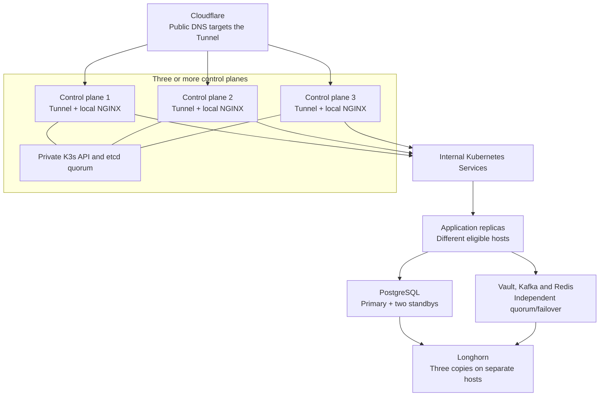

# High availability

HA is an explicit migration for a cluster with additional physical hosts. The
single-server deployment remains the default; this guide does not mean HA is
already running there. Node enrollment alone adds control-plane redundancy.
Shared data services, public ingress and each application have their own
activation steps.

## Availability boundaries

| Component | Opt-in behavior and limits |
| --- | --- |
| K3s | Three or more control planes with an odd embedded-etcd membership; a majority must remain available |
| Public ingress | One NGINX pod and co-located Cloudflare Tunnel connector per control plane; public DNS targets the tunnel |
| PostgreSQL | CloudNativePG primary and two standbys on different hosts; each commit requires one synchronous standby, and the canonical Service follows the primary |
| Kafka | Three native KRaft controllers and brokers, replicated topics and an enforced minimum in-sync replica count after migration |
| Vault | Three Raft voters on different control planes, with recovery material available on every verified control plane |
| Shared Redis | Three Redis/Sentinel servers and redundant HAProxy endpoints; replication is asynchronous and recent cache writes can be lost |
| DNS, secrets and identity | Replicated CoreDNS, External Secrets components and Keycloak; identity still depends on PostgreSQL |
| Argo CD | Replicated API, repository and ApplicationSet services with a replicated cache; one application controller restarts after a host failure |
| External applications | Each repository owns its availability profile, replica placement, shared-state migration, secrets and background-work rules |
| Persistent singleton tools | GitLab/Registry, SonarQube Community, Odoo and other unreplicated services recover by restarting their existing writer with its volume; they have an outage during recovery |

These profiles target a single-host failure while the remaining hosts have
quorum and capacity. They do not provide site-level disaster recovery or remove
Cloudflare, the private transport and external identity/email/storage providers
from the dependency chain. Replicas and Longhorn snapshots do not replace
[offsite backups and restore testing](operations.md#backups-and-recovery).



The diagram shows logical routing; control planes can also be the eligible
application and storage hosts. The etcd quorum maintains Kubernetes state,
while each data service maintains its own replication. Losing one public
ingress host leaves the other Tunnel connections available.

## Prepare hosts and capacity

Use at least three Ready, uncordoned control planes and three storage-eligible
hosts on the same [private node network](networking.md). Three control planes
can also host applications and storage. With
`CONTROL_PLANE_SCHEDULABLE=false`, provide at least three workers for those
workloads; ingress and Vault explicitly tolerate the control-plane taint.

Required hostname spreading prevents replicas from sharing one host. Plan
enough CPU, memory and free disk for the remaining hosts to carry service after
one fails, including builds, storage rebuilds and migration copies. Three
Longhorn replicas of each of three database PVCs can consume nine physical
copies of the database. Inspect actual usage and requested capacity, rather
than treating a PVC size as allocated disk space. See
[storage placement](node-enrollment.md#scheduling-and-storage).

Arrange private SSH between verified control planes, passwordless sudo for
the operator, and access to a surviving control plane. K3s agents discover API
servers through their [built-in client load balancer](https://docs.k3s.io/architecture#how-agent-node-registration-works).
External `kubectl` clients must use a reachable control plane's private API;
this repository does not create a floating administrative API address.
[Node enrollment](node-enrollment.md#control-plane-administration) covers
reconciling access and enrolling through a surviving server.

## Activate in order

Run from an authenticated control-plane checkout with the normal
[installer identity and network inputs](installation.md#unattended-installation).
Keep migration journals, dumps, credentials and recovery files in private
durable directories outside Git. Schedule maintenance for data cutovers and
the transition from direct ingress to Tunnel ingress.

1. **Install normally, then enroll the extra hosts.** Leave the platform HA
   switch unset while bootstrapping and adding the first additional servers:

   ```bash
   ./add-node.sh --role control-plane --mode remote --count 2
   # If control planes will not run application/storage workloads:
   ./add-node.sh --role worker --mode remote --count 3
   ```

   The node assistant handles the existing single-server K3s database's
   conversion to embedded etcd and joins hosts sequentially. Verify all planned
   hosts are Ready before proceeding. See [node enrollment](node-enrollment.md)
   for transport, final counts and scheduling choices.

2. **Migrate PostgreSQL explicitly.** Follow [PostgreSQL HA](postgres-ha.md):
   prepare the isolated cluster, pause reconciliation and database writers,
   migrate the existing databases, verify them, then cut over the canonical
   Service. Use fresh mode only when its empty-installation prerequisites hold.
   Preserve the generated full active `postgresHa` profile and retained source
   volumes. Do not resume an old writer after new commits reach the HA cluster.

3. **Migrate Kafka explicitly.** Follow [Kafka HA](kafka-ha.md) to retain the
   existing cluster identity and records, expand the quorum and brokers, and
   verify topic replication before enforcing the final write policy. Preserve
   its generated full active `kafkaHa` profile. General HA activation refuses
   an unfinished PostgreSQL or Kafka migration.

4. **Migrate and verify Vault.** Follow
   [the singleton migration](vault.md#migrating-an-existing-singleton) with the
   deployed compatible image and explicit `VAULT_HA_MIGRATE_EXISTING=true`.
   Verify three healthy voters, then
   [distribute recovery material](vault.md#host-unseal-service) to every verified
   control plane. Keep recovery keys and a tested Raft backup outside the
   cluster as well. Routine Helm upgrades use guarded, one-peer-at-a-time
   replacement.

5. **Reconcile the shared HA profile.** Combine the reviewed full active
   `postgresHa` and `kafkaHa` maps into a persistent platform values file. Do not
   replace either map with only an `enabled` flag or copy credentials into it.
   Supply the Cloudflare token and Access inputs from
   [public networking](networking.md#cloudflare), including account-level
   Tunnel Edit permission. Set the existing final node counts and scheduling
   inputs, then use either entry point:

   ```bash
   export HIGH_AVAILABILITY_ENABLED=true
   export PLATFORM_HA_VALUES_FILE=/path/to/reviewed-platform-ha-values.yaml
   ./install-control-plane.sh --yes

   # Alternative for an installed platform, using the same exported inputs:
   ansible-playbook -i ansible/inventory ansible/deploy.yml \
     -e configure_cloudflare=true
   ```

   The installer renders shared Helm/Kubernetes resources and the platform
   Argo Application from the same verified profile. Preserve that profile in
   the installation's desired configuration so GitOps reconciliation retains
   the migrated services. It increases Longhorn replication to three copies
   and enforces separate-host placement; wait for actual replica health before
   relying on storage recovery. Cloudflare publication waits for connectors on
   at least three distinct Ready control planes and verified HTTPS origins.

   Shared Redis starts with an empty cache; cached responses and rate-limit
   counters rebuild after cutover. Its original PVC is retained. Durable
   consumers must keep durable records and background jobs outside that cache.

6. **Activate application-owned availability.** Follow each repository's own
   deployment guide after its shared dependencies are healthy. Replicated
   web/API workloads need separate eligible hosts, shared durable state and
   authentication secrets, readiness probes and disruption budgets. Database
   schema migrations must finish safely before admitting new writers.

   The application must define whether background workers can run concurrently
   and how retries, leases and external side effects behave. Local files or
   embedded databases need an explicit shared-storage or database migration;
   increasing a replica count alone does not make them safe.

   Persist the selected profile and source path in the application repository's
   Argo CD Application and release automation. The platform does not choose or
   apply application overlays, migrate application data, or control releases.

## Reconciliation and recovery

`infra/bm-cluster-topology` stores the selected availability mode. Later node
enrollment, installer and Ansible runs inherit it when the environment switch
is unset. Verified PostgreSQL and Kafka cutover records preserve their full
active profiles. A supplied profile must match those records; incomplete
migrations and implicit HA downgrades stop before ordinary workload changes.
The topology helper's explicit downgrade override is not a database, Vault,
ingress or application rollback procedure.

Longhorn provides replicated storage, not application-level writer fencing.
For a persistent singleton on an unreachable host, first prove the old host
cannot write before permitting volume recovery on another host. HA disables
Kubernetes' timeout-based force detach. Without verified fencing, these
services wait for safe manual recovery rather than starting a competing writer.
[Optional node fencing](node-fencing.md) uses explicitly enrolled Redfish BMCs;
it remains disabled without verified hardware access and inventory. An OVH
account or ordinary provider API credentials alone do not establish that access.

Activation verifies the storage-detach policy on each control plane and restarts
K3s sequentially when the setting needs to change, checking that a fresh etcd
majority survives every restart. New HA control planes receive the same policy.
This is part of the planned activation maintenance window.

Argo CD's application controller briefly stops reconciling when its one active
pod is replaced; already running applications continue serving. PDBs constrain
voluntary disruption, not hardware loss. Redis failover can lose recent cache
or rate-limit state, and remote background effects can require retry or manual
reconciliation. Keep each application's delivery and lease guarantees in its
own guide; do not scale singleton workers solely because the cluster is HA.

## Verify before relying on HA

From an authenticated control plane, run the read-only platform readiness checks
after the shared-service migration and activation steps:

```bash
python3 scripts/verify-high-availability.py
# Also require configured fencing coverage for automatic singleton recovery:
python3 scripts/verify-high-availability.py --require-fencing
```

The checks inspect shared-service placement, data-service quorum and storage
copies. They do not read application workloads or certify application
availability. Each application repository must verify its own replicas,
placement, request handling and writes. The fencing option also checks inventory
coverage and that the controller has completed a run; a real power-control
exercise remains necessary. These checks do not enable HA or power off hosts.

Then perform a controlled one-host failure drill,
including the original control plane and a current database/consensus leader.
Check public requests, authenticated sessions, database writes, Kafka
production/consumption and Vault access through surviving instances. Exercise
singleton recovery only after verified fencing. Test one failure at a time and
restore healthy quorum and storage replicas between drills.

Include configured public hostnames, OIDC redirects, trusted client IPs, Registry
login and an image push/pull in public-path verification. Cloudflare still applies its
normal request limits, and interrupted connections may need client retries.
Finally restore a backup into an isolated environment and compare application
data. Repository render/tests are useful preparation; they cannot establish
host-failure behavior on a single server.

The maintained defaults are in [Helm values](../k8s/values.yaml),
[HA templates](../k8s/templates/), and [component profiles](../config/).
Use [networking](networking.md#cloudflare) for the public trust boundary and
the linked service guides for migration and recovery details.
