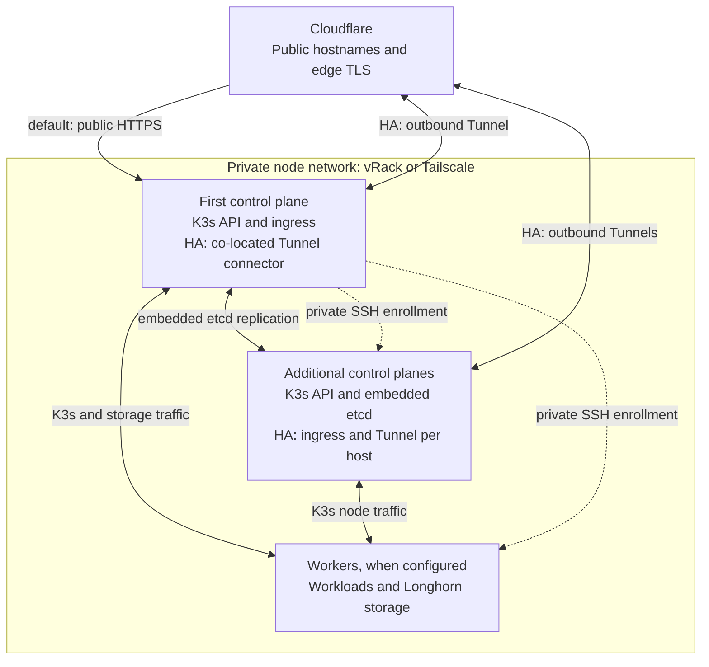

# Networking

Nodes communicate over one private transport. The default public entry point
is the first control plane. After explicit [HA activation](high-availability.md),
public traffic reaches a Tunnel connector and its local ingress on each
control plane, with no dependency on the first host's public address.

## Node topology



Solid links show runtime traffic; dotted links show enrollment. Additional
control planes and workers depend on the selected topology. Workload scheduling
and Longhorn placement follow the [node enrollment policy](node-enrollment.md#scheduling-and-storage). The default
and HA ingress paths are alternatives: adding control planes leaves the first
path in place until the explicit migration.

K3s agents learn the available API servers through their
[built-in client load balancer](https://docs.k3s.io/architecture#how-agent-node-registration-works).
Operator access uses a reachable control plane's private API and verified
private SSH; no floating administrative API address is installed.

## Private node network

| Transport | Use when | Prepare |
| --- | --- | --- |
| OVHcloud vRack | Every node is an eligible OVHcloud Dedicated Server | Activated vRack, attached interfaces, unused RFC1918 subnet and unique node addresses |
| Tailscale | Nodes span providers, locations or unrelated LANs | Tailnet and a temporary personal API access token |

The [installer](installation.md) and [node assistant](node-enrollment.md) share
the account wizard and transport setup. They validate the account, prepare the
private interface, prove private SSH, and then apply UFW. Keep provider console
or rescue access available while configuring a new network.

### OVHcloud vRack

Activate the vRack and record every server's service name, private NIC name or
MAC, and assigned private address. Attach servers manually in the OVHcloud
Control Panel, or let the wizard attach their interfaces through the API.
Host configuration uses Netplan or ifupdown and preserves the public route.

For unattended installation on a prepared vRack:

```bash
export K3S_NODE_TRANSPORT=vrack
export K3S_PRIVATE_ADDRESS=10.40.0.10
export K3S_PRIVATE_INTERFACE=eno2
export K3S_NODE_NETWORK_CIDR=10.40.0.0/24
export K3S_CONTROL_PLANE_IPS=10.40.0.11,10.40.0.12
export K3S_WORKER_IPS=10.40.0.20
export K3S_CONTROL_PLANE_SSH_USER=admin K3S_WORKER_SSH_USER=admin
```

Use `K3S_PRIVATE_INTERFACE_MAC` to verify the expected NIC and
`K3S_VRACK_VLAN_ID` for a tagged vRack VLAN when needed. Final node counts and
scheduling remain [installer inputs](installation.md#unattended-installation).

API-managed attachment additionally uses `OVH_VRACK_AUTOMATE_ACCOUNT=true`,
`OVH_API_ENDPOINT`, `OVH_VRACK_SERVICE_NAME`,
`OVH_CONTROL_PLANE_SERVICE_NAME`, `OVH_APPLICATION_KEY`,
`OVH_APPLICATION_SECRET` and `OVH_CONSUMER_KEY`. The temporary credentials need:

```text
GET  /vrack
GET  /vrack/*
POST /vrack/*/dedicatedServerInterface
GET  /dedicated/server/*/networking
```

The wizard prints the regional credential page and verifies access before
making changes. Revoke temporary credentials after enrollment.

### Tailscale

Create a short-lived personal API token in the tailnet's **Settings > Keys**
page using an account allowed to manage its devices and policy. The wizard
accepts a `tskey-api-` token and issues one-use tagged device keys itself. See
the [Tailscale API documentation](https://tailscale.com/docs/reference/tailscale-api).

```bash
export K3S_NODE_TRANSPORT=tailscale
export TAILSCALE_TAILNET='example.com' # '-' uses the token's tailnet
export TAILSCALE_MESH_NAME=bm-cluster
export TAILSCALE_NODE_HOSTNAME=bm-control-plane
read -rsp 'Tailscale personal API token: ' TAILSCALE_API_TOKEN
echo
export TAILSCALE_API_TOKEN
```

The configurator merges this cluster's role tags and grants into the existing
policy, installs Tailscale on each target, and discovers its private address.
K3s binds to `tailscale0` with trusted node CIDR `100.64.0.0/10`. Control planes
and workers have separate grants; etcd traffic is limited to control planes.
Unset and revoke the API token after enrollment.

To provision just the mesh, run `./scripts/configure-tailscale.sh --fleet`.
For K3s membership, use `./add-node.sh` so installation and security are also
reconciled.

## Exposure boundaries

| Node | Inbound access |
| --- | --- |
| First control plane | Default local or internet exposure; direct public HTTP/HTTPS is restricted to Cloudflare networks. HA ingress uses an outbound Tunnel instead of public ServiceLB |
| Additional control plane | Private SSH from verified control planes, private Kubernetes API and etcd peers; HA adds an outbound Tunnel with local ingress, without public ServiceLB advertisement |
| Worker | Private SSH from verified control planes and required K3s/Longhorn peer traffic; no inbound server API, etcd or public ingress |

Added nodes use default-deny inbound UFW. Both host input and forwarded
Docker/Kubernetes traffic are restricted on non-cluster interfaces for IPv4
and IPv6; outbound connections and their replies remain available. Private
SSH must originate from the declared control-plane address before the
provider-facing path is closed. See [host security](security.md) for controls
and audits, and [node enrollment](node-enrollment.md) for role-specific setup.

## Service DNS and registry routing

CoreDNS resolves `<service>.internal.<your-domain>` to the matching Service in
`infra`, preserving additional DNS labels for headless services. Curated aliases route
services such as Longhorn into their own namespaces. Application-owned
services use canonical Kubernetes DNS names. The private zone is cluster-only;
Cloudflare does not publish it, and ordinary host resolvers cannot use it.

K3s/containerd routes `registry.<your-domain>` to the fixed internal Registry
service endpoint. Cluster automation uses internal GitLab/API routes, while
the Dependency Proxy uses canonical `gitlab.<your-domain>` HTTPS. Kubernetes
API clients retain `kubernetes.default.svc`, which matches the server certificate.
Public Docker clients use `registry.<your-domain>` over HTTPS.

In the opt-in HA profile, CoreDNS runs three replicas across three hosts with
an availability budget of two. The HA admission policy preserves that placement
and replica count when K3s reapplies its packaged Deployment or a scale request
is submitted. The installer triggers reconciliation after installing the policy.
External Secrets uses two replicas per component; its main and certificate
controllers elect leaders, while both webhook replicas accept requests.

The shared HA cache accepts application traffic only through HAProxy on port
6379 from `infra`, `apps` and `corp`. Its Redis and Sentinel ports accept traffic
only from that release's server and HAProxy pods in `infra`. Applications cannot
reach Sentinel management directly; these NetworkPolicies preserve the existing
application cache credential contract.

## Cloudflare

Platform host inventories live in [config/platform.env](../config/platform.env).
The configurator reconciles their proxied DNS, Origin CA TLS, DNSSEC, WAF/cache
rules and Keycloak-backed Access for administration. Application names are not
part of that inventory. Apex DNS publication is disabled by default; set
`CLOUDFLARE_PUBLISH_APEX=true` only when the platform should manage that record.
Applications own their public DNS records, Ingress resources and redirects,
including apex/`www` behavior when applicable.

Homepage is published at `intranet.<your-domain>` and protected by Cloudflare
Access. Its Ingress, allowed hosts and links share that hostname. The retired
`dashboard` label remains in `DEFAULT_CLOUDFLARE_RETIRED_HOST_LABELS` so Cloudflare
reconciliation removes its old address records and Access application.

In the default layout, node administration has a separate unproxied hostname
controlled by `CLOUDFLARE_NODE_DNS_LABEL`. HA public-host reconciliation does
not publish node administration records; maintain any required record separately.

```bash
./scripts/configure-cloudflare.sh --zone example.com
```

The script prompts for a scoped Cloudflare **User API Token** and prints the
required permissions. For automation, supply `CLOUDFLARE_API_TOKEN`,
`CLOUDFLARE_ACCESS_ALLOWED_EMAILS` and `CLOUDFLARE_ACCESS_TEAM_NAME`. Complete
registrar nameserver delegation and DNSSEC prerequisites before unattended
setup; interactive setup pauses with the required registrar values.

### Application DNS ownership

Each application declares its own DNS records and owns their lifecycle.
[`add-repos.sh`](repository-onboarding.md) can provision or reconcile those exact
hosts from `infra/onboarding.json`, without adding names to this repository.
Direct ingress uses proxied A records targeting its unique public IPv4.
Changing a hostname does not delete the old record; retire old hosts explicitly
after verifying the replacement route.

After HA activation, use proxied CNAME records targeting
`<publishedTunnelID>.cfargotunnel.com`. The platform publishes its nonsecret
endpoint state in `infra/bm-cluster-public-ingress`:

```bash
kubectl -n infra get configmap bm-cluster-public-ingress -o json
```

An application must wait until `data.mode=tunnel`, `data.publishedTunnelID` is
nonempty and equals `data.tunnelID`, and `data.domain` matches its zone before
switching DNS. A prepared tunnel is not an activated endpoint. Repository
onboarding checks these conditions before publication; rerun it for the app's
DNS cutover after platform HA activation. Conflicting address records or another
application's Ingress ownership stop reconciliation. Unrelated MX/TXT records
are preserved. App-owned checks still verify the public route and failover.

The tunnel accepts the configured zone apex and wildcard subdomains and forwards
them to local Traefik; Kubernetes Ingress resources select the application. This
uses Cloudflare's [hostname wildcard matching](https://developers.cloudflare.com/tunnel/advanced/local-management/configuration-file/#wildcards).
It creates no wildcard DNS record and grants no application deployment ownership
to the platform. A hostname without a matching Ingress receives Traefik's default
404 response. Other public zones require a separate ingress and DNS arrangement.

### Ingress controller

The platform installs Traefik through its own pinned Helm release, with K3s
bundled Traefik disabled. Native Kubernetes Ingress preserves application-owned
hosts, DNS/Homepage discovery and TLS secrets. Same-namespace Middleware adds
authentication and request limits; Thoughty uses native weighted routes for its
canary. This keeps the existing ownership model without another routing API
migration. See [controller migration](platform-migration.md) for existing clusters.

Only HTTP/HTTPS entry points receive public application routers. The shared
header Middleware removes RFC `Forwarded`, `X-Real-IP` and forwarded routing
overrides. Preserve Traefik's default appended `X-Forwarded-For` chain: app rate
limiters validate the trusted proxy boundary and take the visitor immediately
before the edge, or the single sanitized address for a direct client.

For the platform host inventory, the Cloudflare configurator removes incoming
`X-Forwarded-For` through a request-header transform. Cloudflare then supplies
the visitor address itself, as documented in its [header transform behavior](https://developers.cloudflare.com/rules/transform/request-header-modification/#important-remarks).
This prevents stock services from trusting a visitor-supplied leading address;
app rate limiters also validate the chain locally. Verify the rule at the live
edge during cutover, especially if Workers or additional proxies handle a host.

The Traefik release publishes its trusted edge ranges in
`infra/ingress-proxy-trust`. GitLab uses those ranges with its private proxy trust
in both Rails and its bundled NGINX. NGINX resolves the visitor recursively from
`X-Forwarded-For` before forwarding that address to Workhorse, preserving the
visitor identity for audit logs and rate limits.
After changing ingress mode or edge ranges, restart GitLab in a maintenance
window to reload that environment input. A GitLab installation without ingress
uses private proxy defaults. The token needs Zone **Transform Rules Edit** in
addition to the listed DNS/security permissions.

### HA public ingress

The [HA ingress profile](../config/traefik-ha-values.yaml) runs Traefik as a
DaemonSet on control planes, with one co-located `cloudflared` container per
pod. Every connector uses the same tunnel identity and connects outbound to
Cloudflare. Traefik uses normal pod networking and an internal Service; additional
hosts need no inbound public web listener or shared public IP.

The connector sends HTTPS to its own Traefik listener over loopback, verifies the
Cloudflare Origin CA certificate against the public domain, and preserves the
request Host. Traefik trusts the forwarded client-address chain only from that loopback peer.
A shared Middleware clears forwarded routing headers and derives host, URI and
method from the request; the public scheme is HTTPS.
Application proxy and NetworkPolicy contracts still see the Traefik pod network.
Keycloak/OIDC URLs, Access protection and Registry authentication retain their
public hostnames.

The connector's liveness check withdraws it when its local Traefik stops serving;
its readiness check requires a connected tunnel. Before changing public DNS to
the tunnel CNAME, the configurator checks connectors on at least three distinct
Ready control planes and performs verified HTTPS origin probes. The API token
also needs account-level **Cloudflare Tunnel Edit** permission. Use the ordered
[HA migration](high-availability.md#activate-in-order); allow a maintenance
window for replacing the direct ingress path.

Tunnel replicas provide connection redundancy; they do not promise even
traffic distribution or preserve an interrupted client connection. See
[Cloudflare's replica and load-balancer distinction](https://developers.cloudflare.com/tunnel/routing/#replicas-versus-load-balancers).
Public uploads still pass through Cloudflare's request limits. Verify Registry
push/pull and application login through the tunnel before relying on failover.

Registry clients cannot answer browser bot challenges. Reconciliation disables
basic Bot Fight Mode, which has no hostname exceptions, and skips Super Bot
Fight Mode only for the Registry hostname. Other WAF, rate-limit and TLS
controls remain enabled. The token therefore needs **Bot Management Read** and
**Edit**, in addition to the other permissions printed by the configurator.
