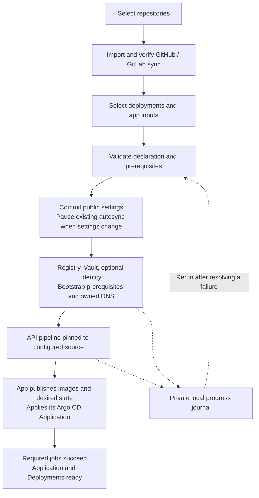

# Add, synchronize and deploy repositories

Run `./add-repos.sh` from this checkout on a configured control-plane host. It
imports GitHub repositories into GitLab, configures two-way synchronization,
and sets up the repositories selected for deployment. Run it again to add more
repositories, change saved settings, or resume an interrupted deployment.
`./replicate-repo.sh` is a compatibility wrapper for the same command.

The installer calls this helper after platform and Argo CD setup when repository
onboarding is selected. [Ansible](ansible.md#optional-host-and-account-changes)
uses the same helper and unattended inputs. Application declarations stay in
their repositories; `bm-cluster` has no application inventory.

## Guided flow

1. Enter your GitHub username, a hidden personal access token, and comma-separated
   repositories such as `catalog,org/api`. Bare names belong to your user.
2. Confirm the public GitLab HTTPS URL and destination group. The URL defaults
   from the platform domain or installed GitLab Ingress; the group defaults to
   `swirlit` and may be nested. Each source keeps its repository name.
3. Missing groups/projects are created privately. The managed GitHub sync workflow,
   encrypted Actions secrets/variables and GitLab push/tag webhook are reconciled,
   then initial synchronization is verified. An unrelated workflow at the managed
   path is reported instead of overwritten.
4. The deployment answer is prefilled with all successful repository names.
   Accept all, enter a comma-separated subset, or enter `none`.
5. The helper reads each selected repository's `infra/onboarding.json`, asks for
   its declared inputs, and validates configuration and service prerequisites.
   Previous public settings are offered as defaults.
6. Public configuration is committed to the app's default branch with `[skip ci]`.
   Requested registry/Vault/identity resources and bootstrap prerequisites are
   reconciled, followed by application-owned DNS.
7. An API pipeline receives the expected source SHA and a unique run ID. Its release job publishes
   images and applies the application-owned Argo CD Application. The helper waits
   for required jobs, the release's exact `Synced`/`Healthy` revision and declared
   Deployment rollouts.

Selecting deployment authorizes these configuration commits and service changes.
The helper uses platform-owned operations, not downloaded setup scripts. It
reports `[READY]` only after delivery and readiness succeed. Missing contracts,
prerequisites or required jobs produce `[CANNOT DEPLOY]`; imports remain available
for correction and retry, and failures make the command exit nonzero.



New projects have CI disabled during import; selecting a valid deployment enables
CI and the shared runner. Skipped new projects keep CI disabled. Existing projects
retain their CI setting, so ordinary synchronized source commits can still start
existing pipelines.

When public configuration changes, an existing automatically synced Application
is paused before the settings commit is published. Workloads remain running.
The app's release job reapplies its committed Application after publishing images,
restoring its sync policy. First deployment is also owned by that release job;
onboarding does not start application workloads ahead of it.

Repository onboarding does not add nodes, activate HA or change an app's selected
deployment path. Follow the [HA guide](high-availability.md) and application-owned
migration instructions when sufficient physical hosts exist. The shared `apps`
namespace and its platform foundation do not depend on enabling Odoo in `corp`.

## Prerequisites and credentials

The host needs Bash, Git, curl, jq, GNU date, Python, PyYAML and libsodium. The
installer supplies the Ubuntu/Debian packages. Deployment also needs the
control-plane kubeconfig, `kubectl`, Argo CD in `infra`, the instance runner and
requested shared services. Local Helm charts require Helm. Vault must be unsealed
with its KV-v2 `secret/` mount; External Secrets and public ingress/TLS must work.
Before publishing configuration, onboarding checks the shared `apps` foundation,
the AppProject's repository/destination permissions and certificate coverage for
the declared hosts. Repository credentials must complete a fresh successful
ExternalSecret refresh before delivery starts.

Use a GitHub [fine-grained PAT](https://github.com/settings/personal-access-tokens/new),
not an account password. Selected repositories require **Administration, Actions,
Contents, Secrets, Variables and Workflows: read/write**. Organization rules must
permit the token and Actions. Branch protection must permit workflow installation,
configuration commits, synchronization and release pushes. Rejected operations
are reported; the helper does not relax protection. Empty or archived sources
are unsupported.

| Credential | Scope and handling |
|---|---|
| GitHub PAT | Encrypted Actions secret `REPOSITORY_SYNC_ADMIN_TOKEN` and GitLab webhook Authorization header; rerun with a replacement before expiry. |
| GitLab sync project token | `write_repository` and `self_rotate`; the monthly GitHub workflow rotates it near expiry. |
| GitLab setup administrator token | Issued locally through `gitlab-rails` and revoked on exit. An explicit `GITLAB_ADMIN_TOKEN` with `api` scope is accepted and retained. |
| App registry deploy token | `read_registry` and `read_repository`, stored at the app-declared Vault path; valid credentials are verified and reused. |
| Argo CD repository access | A generic `infra/repository-<hash>` ExternalSecret projects the verified app registry/repository credential from Vault; no separate unmanaged password is copied into Git. |
| Cloudflare API token | **Zone Read** and **DNS Edit** for the selected zone; environment or hidden prompt. Onboarding uses an existing HA Tunnel rather than creating one. |
| Vault setup access | Private `VAULT_BOOTSTRAP_TOKEN_FILE`, default `/var/lib/bm-cluster/vault-bootstrap-token`; access through a local port-forward. Declared paths need read/create/update and KV metadata-read access. |
| Optional Keycloak setup access | Uses the platform administrator Secret and a local port-forward; no client credentials are committed. |

Secrets stay in memory or private temporary credential files during setup, outside
Git and the progress journal. Declared secret inputs use hidden prompts. Keep
unattended inputs outside repositories with mode `0600`; operator-supplied files
are not automatically deleted.

Setup normally reaches GitLab through a temporary loopback `kubectl port-forward`
for API requests, cloning and registry authentication. This avoids depending on
the operator host's DNS or browser authentication. An explicit `GITLAB_URL`
overrides that control route; when the GitLab Service is unavailable, imports
fall back to public GitLab. Deployment still requires access to the cluster.

Synchronization uses `GITLAB_PUBLIC_URL`: GitHub Actions must reach public GitLab
API/Git routes, and GitLab must reach `api.github.com`. Browser-only Cloudflare
Access must not intercept those synchronization requests. Argo CD and app CI use
the installed private service zone; temporary loopback addresses are never saved
as application endpoints. See [installed context discovery](application-onboarding.md#public-rendering-context)
for defaults and explicit overrides.

## Deployment contract

The default branch must contain `infra/onboarding.json`, a valid `.gitlab-ci.yml`,
and one Application at `infra/argocd/application.yaml` or `argocd/application.yaml`.
Its source must be a local Kustomize directory or Helm chart following the default
branch, targeting `apps` on `https://kubernetes.default.svc`. Its AppProject must
already allow that source/destination. External charts and multi-source
Applications are unsupported.
Use repository-owned configuration rather than custom Argo CD source overrides;
unsupported Helm/Kustomize source options are rejected so validation and deployment
render the same resources.

The [version-1 contract reference](application-onboarding.md) provides a generic
example, fields and rendering context. Applications declare public/secret inputs,
explicit public files and mappings, registry/Vault/optional identity setup, exact
DNS hosts, bootstrap resources, required pipeline jobs and Deployment names.

Public choices and replacement bindings are committed in
`infra/onboarding-values.json` alongside rendered configuration. Reruns replace
previous rendered values so changed domains/groups survive later releases. The
helper normalizes the Application's GitLab URL, default-branch revision and `infra`
namespace while preserving its source path/profile. App release jobs must honor
these settings and validate `ONBOARDING_EXPECTED_SHA` before publication/deployment.

Vault setup fills missing values with defaults or generated secrets using
version-checked writes. Existing values win; a different supplied credential
fails instead of rotating it. Deleted versions require recovery. Optional fields
can remain empty until the operator enables their integration. Invalid registry
credentials can be replaced, retaining prior tokens until consumers refresh.

DNS changes affect only declared hosts in the selected zone. Direct ingress uses
proxied A records to its unique public IPv4. HA uses proxied CNAME records only
when the same-zone `publishedTunnelID` equals `tunnelID` in
`infra/bm-cluster-public-ingress`. Conflicting address records or another app's
Ingress ownership stop setup. Unrelated MX/TXT records are preserved. A hostname
change does not delete old records; retire them explicitly after verifying the
new route. See [DNS ownership](networking.md#application-dns-ownership).

## Automation and reruns

`--yes` never prompts. Supply `DEPLOY_REPOSITORIES=all`, `none`, or a comma-separated
subset, plus required app inputs. A private JSON file is keyed by GitHub slug:

```json
{
  "alice/catalog": {"APP_SUBDOMAIN": "catalog"},
  "org/api": {"APP_SUBDOMAIN": "api"}
}
```

```bash
chmod 600 /secure/repository-inputs.json
read -rsp 'GitHub personal access token: ' GITHUB_ADMIN_TOKEN; echo
read -rsp 'Cloudflare DNS token: ' CLOUDFLARE_API_TOKEN; echo
export GITHUB_ADMIN_TOKEN CLOUDFLARE_API_TOKEN
GITHUB_USERNAME=alice \
GITHUB_REPOSITORIES='catalog,org/api' \
GITLAB_PUBLIC_URL=https://gitlab.example.com \
GITLAB_GROUP_PATH=team \
DEPLOY_REPOSITORIES=all \
  ./add-repos.sh --yes --inputs /secure/repository-inputs.json \
    --state-dir /secure/repository-state
unset GITHUB_ADMIN_TOKEN CLOUDFLARE_API_TOKEN
```

`--inputs` and `--state-dir` also work interactively. Their environment equivalents
are `REPOSITORY_INPUTS_FILE` and `REPOSITORY_STATE_DIR`. Unknown app input names
fail validation. The state directory is created privately and must have mode
`0700` if it exists.

Export these inputs with `CONFIGURE_REPOSITORY_SYNC=true` for the installer or
Ansible. `ONBOARDING_TIMEOUT` controls the required-job wait in seconds: default
`3600`, range `30`–`43200`. Application synchronization waits up to 15 minutes
within that setting, then checks declared Deployment rollouts.

Progress defaults to `~/.local/state/bm-cluster/repositories`. Each locked journal
records project/cluster identity, configuration and pipeline progress without
credentials. Rerun from the same host/state directory to resume a recorded
pipeline or retry failed jobs. An active earlier pipeline must finish before
settings change. Missing or manual required jobs cannot count as deployment
success; inspect the reported pipeline and correct its cause before rerunning.

Pipeline creation intent is journaled before the API request. If its response is
lost, rerunning looks for the matching source SHA and `ONBOARDING_RUN_ID` instead
of immediately creating another pipeline. An unresolved request stops recovery.
Check GitLab before removing only `pipeline_intent` from the private journal,
and do so only after confirming that request created no pipeline. An ambiguous
HTTP timeout cannot guarantee exactly one pipeline without that confirmation.

Failures can leave configuration commits, credentials, DNS or a paused Application
in place. Completed setup is retained; there is no automatic repository deletion
or data rollback. After configuration is published, the corrected release
restores the Application's policy. If publication never happened, a rerun can
restore the prior policy after verifying the source is unchanged. Other selected
repositories continue, and any
failure makes the command exit nonzero. A new host can recover public choices
from Git; transferring the private journal is necessary to resume its recorded
pipeline rather than start a new operation.

## Synchronization and validation

Reruns preserve visibility; private GitHub sources require private GitLab
projects. Sync fast-forwards the lagging side and merges compatible divergence
without force pushes. Resolve merge conflicts and conflicting tags before
retrying. Deletion on only one side is restored. Issues, pull requests, releases,
packages, Git LFS objects and hosting metadata require separate migration.

The platform GitOps URL is an independent installer choice. Importing this
repository copies source; it does not replace platform installation or Odoo setup.

```bash
./scripts/test-repository-replication.sh
python3 scripts/test-repository-onboarding.py
python3 scripts/test-onboarding-services.py
```

These use local repositories and mocked services. See
[repository validation](operations.md#validation) for the full suite.
